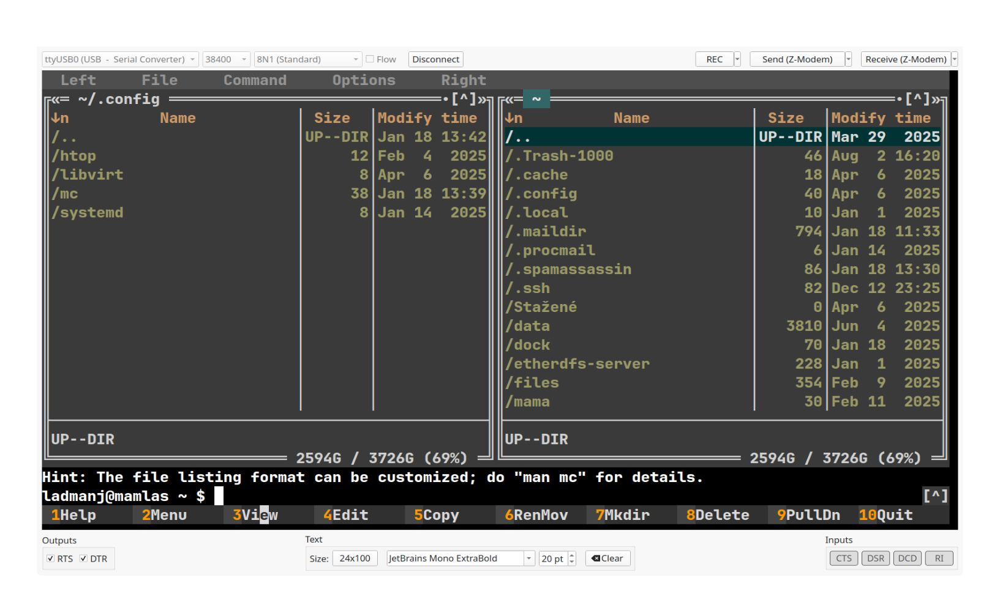

# debuQterm
Simple serial terminal emulator with both VT102 compatibility and manual status lines control



## What is it for?
There are many terminal emulation programs such as putty, mintty, KDE Konsole, Windows Terminal nowadays pretends to be one too. There are also solutions to connect to a embedded device or some ancient gear over serial port. Again putty does it for windows users, minicom, picocom and so on for the others. There are some programs which allow to manualy control handshake lines RTS and DTR and to see the status lines CTS, DSR, CD and RI, for windows there is well known Bray terminal, very old an very buggy. There is HTERM, cutecom and many more.

What I was always missing is the combination of VT102 capable terminal with the hardware debugging features.

Now there is **debuQterm** which does it both.
But ..., on the other side, there is no hex display, macros and such. Your contributions are welcome as well as bug reports and patches of various kinds.

### License
For no specific reason MIT license was chosen.

### Dependencies
libvterm, libQt6Widgets, libQt6Gui, libQt6SerialPort, libQt6Core

For X/Y/Z-modem file transfers you need ```lrzsz``` installed

### Building and installation
Install dependencies according to your system.
 
``` 
sudo apt install libvterm ... 
```

Obtaining source code, compiling and installation
``` 
git clone https://github.com/ladmanj/debuQterm.git
mkdir build
cd build
qmake6 ../debuQterm
make
sudo make install
```

### Origin of the code

Created with the help of Gemini AI, no code is used without human oversight and intervention.
